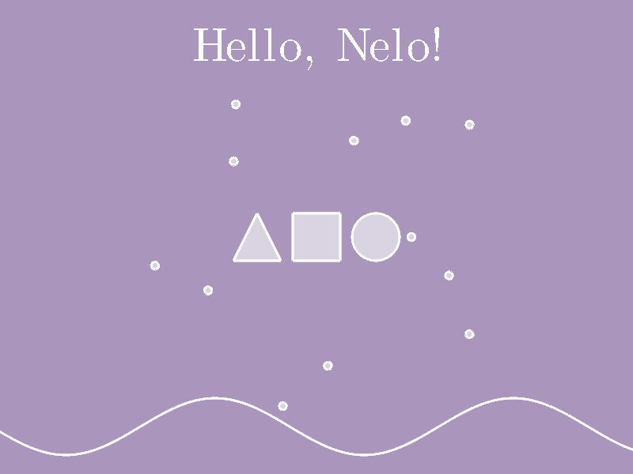

# nelo


[](https://crates.io/crates/nelo)


A stateless, timeline-driven animation engine for explorable visual animations.

## philosophy

> Moments in a scene are independent of one another. Everything is a function of time.

At the heart of nelo is the `Timeline`, a generic type which can be queried at any given time.

Timelines can be built from a few sources:
* Constants
* Closures
* Keyframes

They can also be combined to built much more complicated behavior using a handful of convenient
methods to add, multiply, compose, repeat, or 

Timelines take full advantage of Rust's powerful trait system to make the API a real joy.
You never have to pay for timelines where you don't want them, but you can drop them in 
to animate any parameter on any entity.

## example

Here's the code in 
[`src/scene.rs`](src/scene.rs)
to create the demo:

```rust
pub fn demo() -> Self {
    const PERIOD: f32 = 3.0;
    let mut scene = Self::new();

    // Set the background color.
    scene.camera().background(Vec4::new(0.4, 0.3, 0.5, 1.0));

    // Central pulsing circle.
    scene.circle().scale(
        Timeline::triangle(2.0 * PERIOD)
            .then(Easing::SineInOut)
            .add(0.25),
    );

    // Some circles which go back and for from spirtal to a line.
    scene
        .group()
        .create(16, |_, s| s.circle().scale(0.1))
        .arrange(path::line(Vec2::X * 2.0, Vec2::X * 5.0))
        .for_each(|i, e| e.rotate(Timeline::triangle(6.0).ease().multiply(0.2 * i as f32)));

    // Wavy path.
    scene
        .spline_with_range(
            |t: f32, x: f32| Vec2::new(x, -4.0 - 0.6 * (x - 4.0 * t).sin()),
            -10.0,
            10.0,
        )
        .stroke_weight(0.05);

    scene
}
```

And here's the result rendered at `t = 1.0`:

<p align="center">
  
</p>

## dependencies

Exporting uses `ffmpeg`, so make sure it's installed and avaiable in your `$PATH`.

